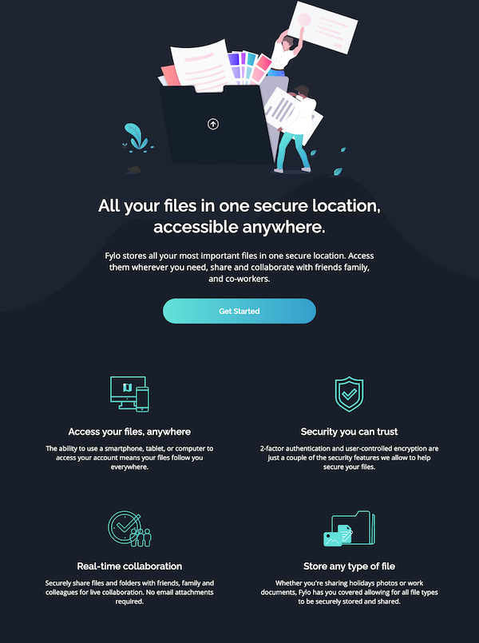

# Frontend Mentor - Fylo dark theme landing page solution

This is a solution to the [Fylo dark theme landing page challenge on Frontend Mentor](https://www.frontendmentor.io/challenges/fylo-dark-theme-landing-page-5ca5f2d21e82137ec91a50fd). Frontend Mentor challenges help you improve your coding skills by building realistic projects. 

## Table of contents

- [Overview](#overview)
  - [The challenge](#the-challenge)
  - [Screenshot](#screenshot)
  - [Links](#links)
- [My process](#my-process)
  - [Built with](#built-with)
  - [What I learned](#what-i-learned)
  - [Continued development](#continued-development)
  - [Useful resources](#useful-resources)
- [Author](#author)
- [Acknowledgments](#acknowledgments)

## Overview

### The challenge

Users should be able to:

- View the optimal layout for the site depending on their device's screen size
- See hover states for all interactive elements on the page

### Screenshot

### Links

- Solution URL: https://www.frontendmentor.io/solutions/responsive-landing-page-using-css-grid-OqZU9w-M6p
- Live Site URL: https://csb-qtps1h.netlify.app

## My process

### Built with

- Semantic HTML5 markup
- Flexbox
- CSS Grid
- Mobile-first workflow

### What I learned

Working on this project was meant to be a learning experience with collaboration. We started out trying to live-code together using the live coding feature inn Visual Studio Code. This was ok, but it didn't give both of us features like intellisense and autocomplete, so we decided not to continue with it. We tried codesandbox.io, but it was hard to see where Parcel-Bundler was compiling the files as sandbox doesn't seem to give you access to the build directory. This was a problem for me when it came time to delpoy the site with Netlify. Trying to debug issues involving missing files or bad filepaths was like shooting in the dark. Eventually, I lost contact with my partner so I decided to bring the project back into Visual Studio and complete it single-handedly. Lessons learned: sandbox and codepen are good for basically that: playing with code in a sandbox. They're not really great for live-code collaboration. Git, unsurprisingly, seems to be much more well-built for that.

My partner did setup the markup using BEM, which for me was a good introduction to that system and did prove to be advantageous in terms of semantics and organization.

### Continued development

Will definitely build on the foundation we have here with writing more meaningful code using more semantic HTML elements and organizational systems like BEM. I would also like to get more comfortable with Sass, since it can make for much more concise code. I am kind of amazed by what can be achieved with pure HTML/CSS and how light a page can feel while still looking fairly polished. This is certainly something to explore further.

### Useful resources

- [About HTML semantics and front-end architecture – Nicolas Gallagher](https://nicolasgallagher.com/about-html-semantics-front-end-architecture/) - Good resource for getting into BEM and Atomic CSS.
- [A Complete Guide to Grid](https://css-tricks.com/snippets/css/complete-guide-grid/) - Hard to beat for getting the basics for working with Grid.
- [Sass Tutorial for Beginners - CSS with Superpowers](https://www.youtube.com/watch?v=_a5j7KoflTs) - Nick is the man and may have launched his Sass course by now.
- [Focus & Keyboard Operability | Usability & Web Accessibility](https://usability.yale.edu/web-accessibility/articles/focus-keyboard-operability) - Yale recommendations for accessibility best practice.

## Author

- Frontend Mentor - [@o-ashour](https://www.frontendmentor.io/profile/o-ashour)

## Acknowledgments

Shout-out to Abdullah who goes by @AFIQUE on github and frontend mentor for helping out at the beginning of the project and introducing me to BEM. Also, the mentors at frontend mentor have been great in promptly answering questions and setting me onto a healthy direction.
